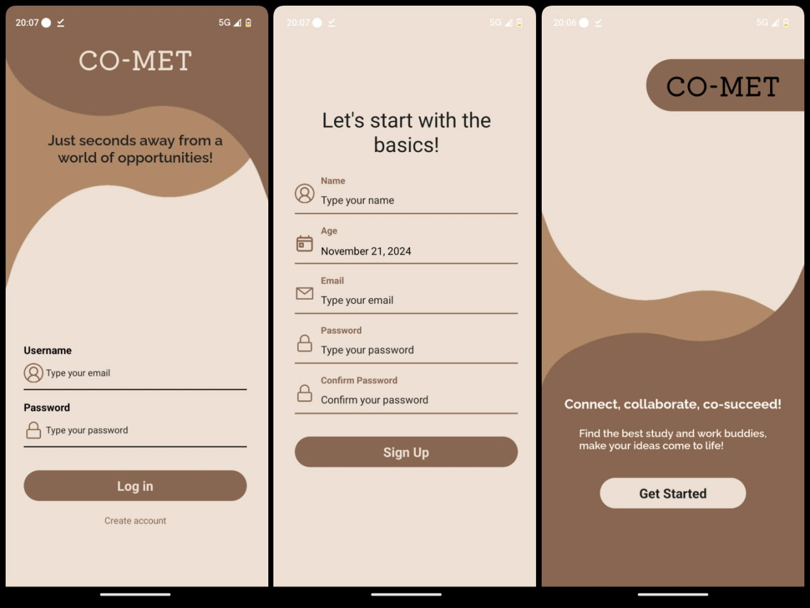
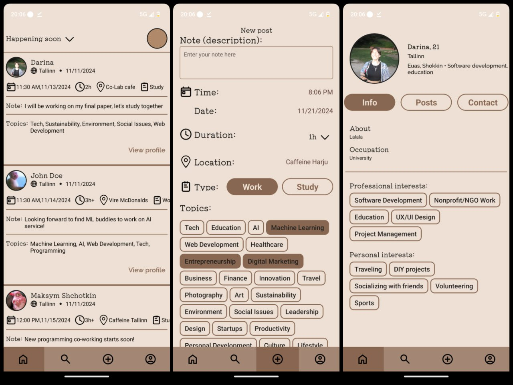

# CO-MET

## Project Description
A social networking app that helps people find company for co-working and co-studying, based on interests, field of work/study and availability. The platform aims to connect individuals who want to work or study together, making remote work and studying more engaging and productive.

Download APK here: https://drive.google.com/file/d/1060BMnRXUX8-Ia_Oelfmhkqm7xFrsH-y/view

## Team Members
- Roman Sokolov (Mobile Development, Leadership)
- Darina Petrova (Design)
- Maksym Shchotkin (QA)

## Screens

## Features
- Sign up, Sign in
- User post-registration data filling
- Add/Edit/Delete post
- Posts filtration by location, preferences
- Edit profile

## Tech Stack
- Frontend: React Native
- Backend: Firebase
- Testing:
  - JUnit
  - JEST
